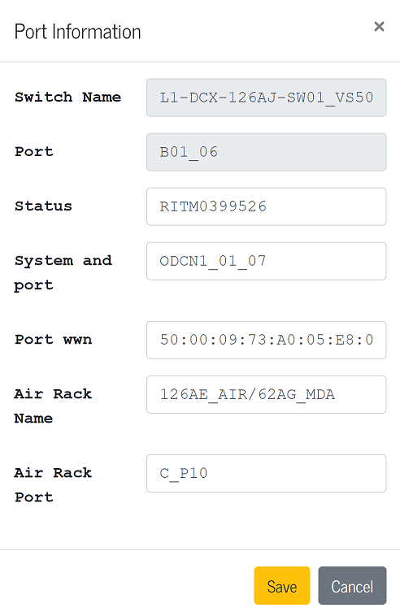

## Lab Discovery
#### This tools will improve the efficiency of the lab team by providing needed information for daily tasks.

## How it works:
#### 1. All users will need to create an account before accessing the information. There will be users with admin roles and operators. 

#### 2. Once in the dashboard, users can select the operation they need. The "Fabrics" module was the concentration component for this project  

#### 3. The Fabrics module offers two options: "Search" and "Reserve".

### When user click on "Search" connectivity information will be displayed  on a table.

### The information on the table can be sorted by a single field or multiple by holding down the "Shift" key and clicking on the desired table header.

### Users can also type on the field under the table headers to get connectivity information for a specific system.

### Each row has and "Edit" link, users with admin rights will be able to modify the information and update the database as needed.

### The "Reserve" option from the "Fabrics" module handles the port assignation when new connections are requested.
### Two tables are displayed for the user to select the ports from the switches and from the patch panels. 
### Once the selection is made, users will have to enter the system(s) information in order to update the databases(not complete at the moment).

## Technologies used
This project was created with:

* NodeJS 
* ExpressJS
* JavaScript
* jQuery
* MongoDB
* Mongoose
* React
* Reactstrap
* React-table
* CSS Grid Layout

## Deployed Site: 
#### https://lab-discovery.herokuapp.com/

## Contributors
* Paola Stone | https://github.com/PaolaStone
